# Beginner friendly projects from 10 to 1

## 1- restaurant. Fully responsive modern restaurant, FORK & USE

### JAVASCRIPT, REACTJS, HTML5, CSS3, variables, npm, media queries, react-icons, CLONE & USE

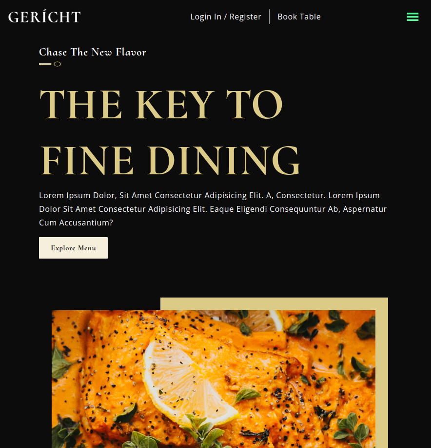

## 2- E-commerce. Responsive landing page for the famous chatgpt platform by openai

### JAVASCRIPT, REACTJS, HTML5, CSS3, variables, npm, media queries, react-icons, CLONE & USE

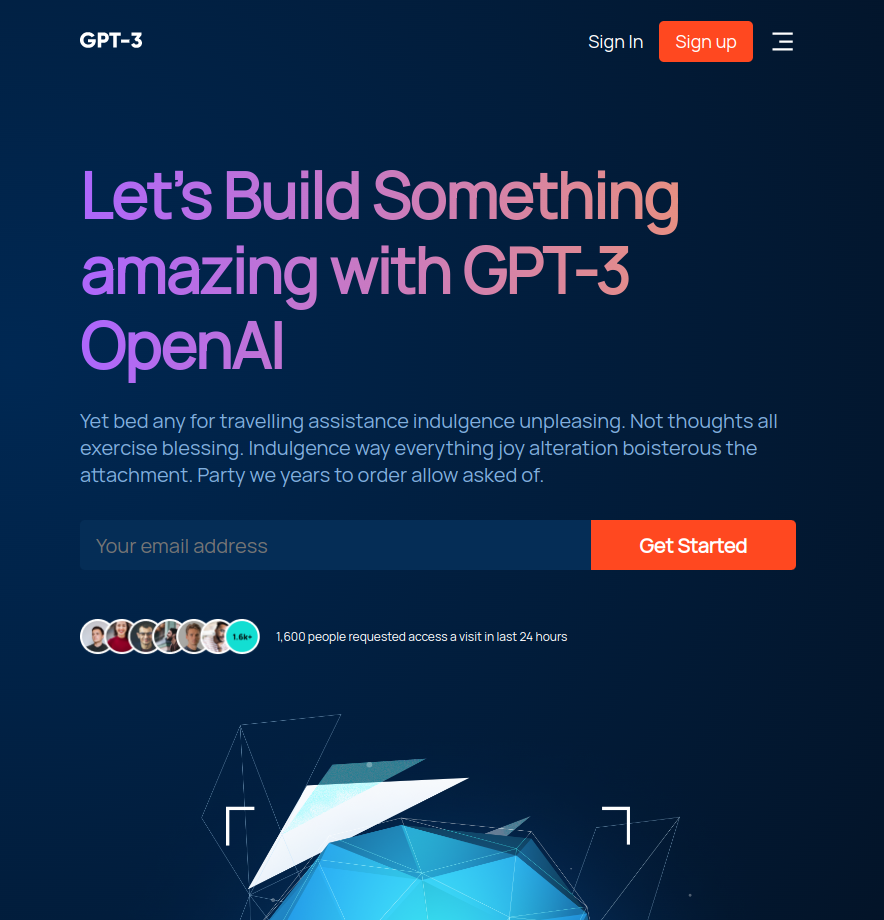

## 3- cafe. Responsive online delivery service for foodies

### HTML5, CSS3, Media queries, variables

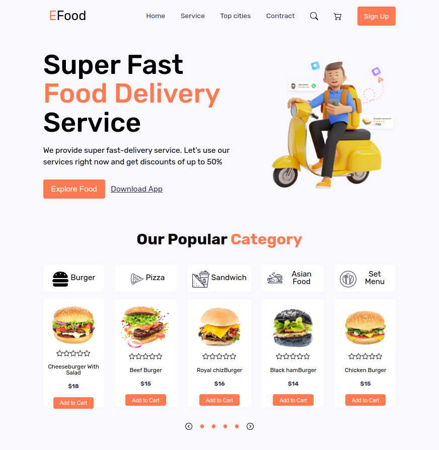

## 4- citylife. Responsive city constructed with css variables

### HTML5, CSS3, Media queries, variables

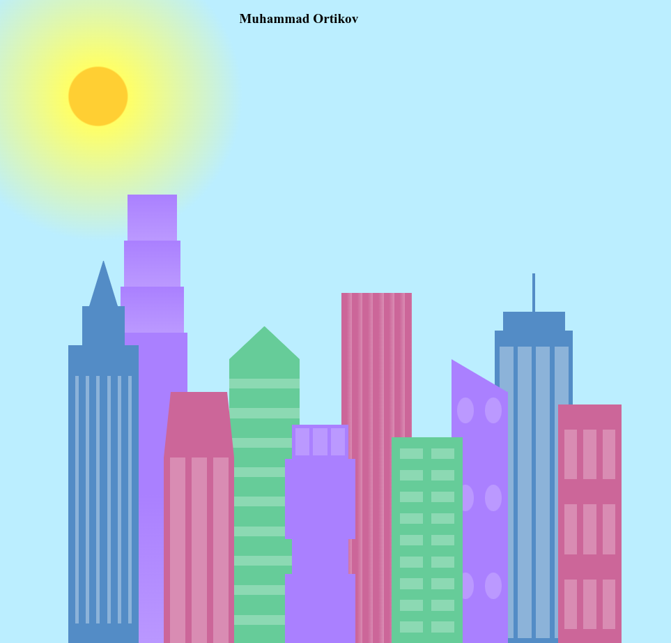
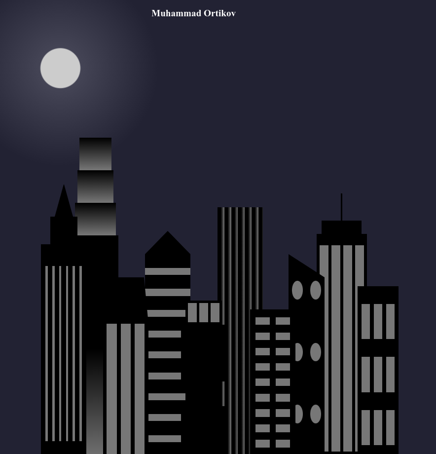

## 5- techdocs. Technical documentations

### HTML5, CSS3

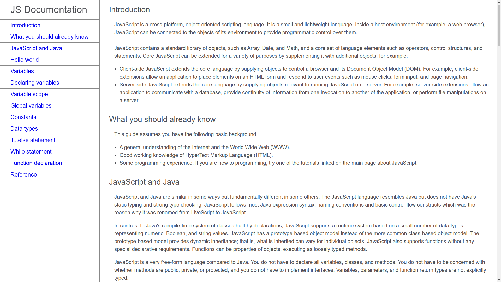

## 6-e-commerce. Responsive landing page for selling musical instruments

### HTML5, CSS3, root variables, media queries

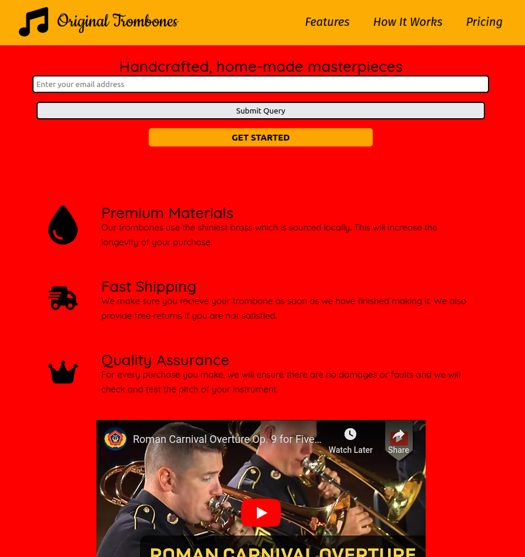

## 7-painting. Check your css skills with my painting

### HTML5, CSS3, variables,

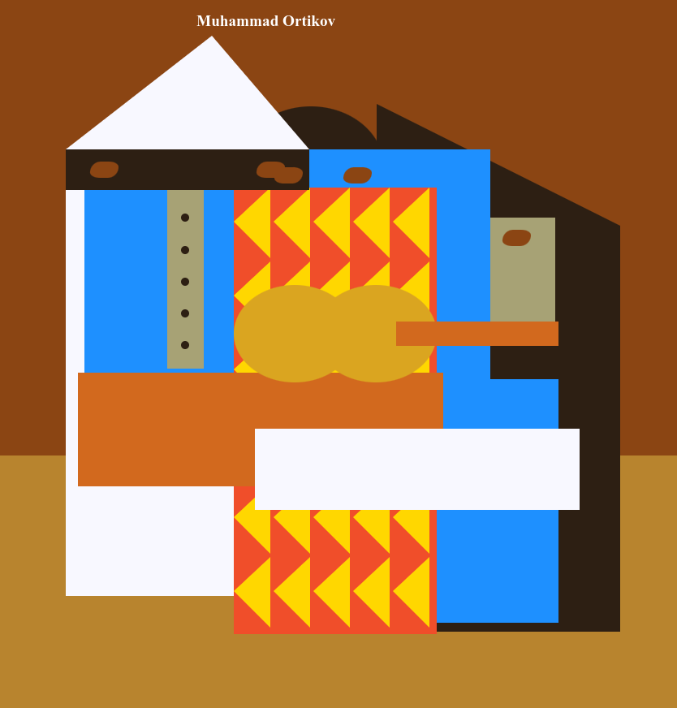

## 8-animation. The waving penguin

### HTML5, CSS3, variables, keyframes->transform

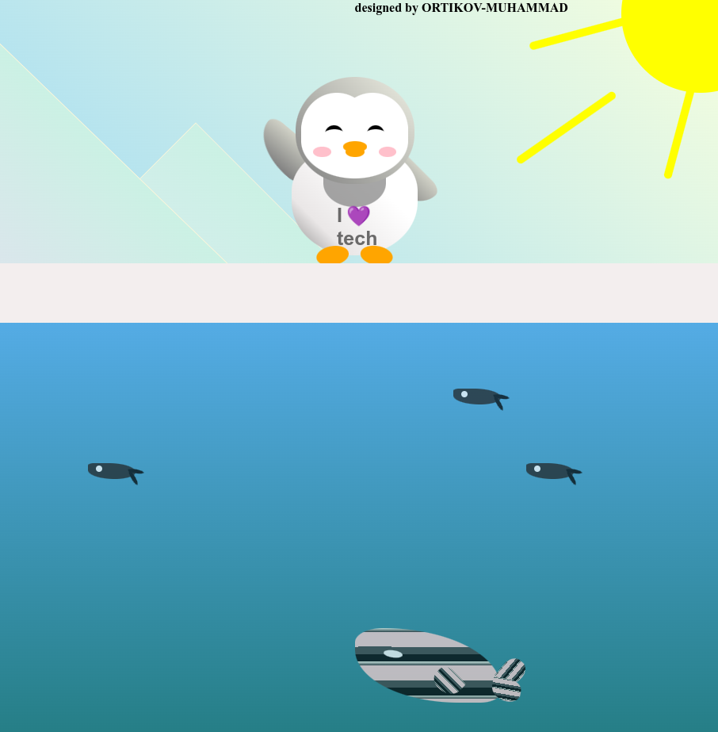

## 9-piano. Responsive design with css variables

### HTML5, CSS3, variables

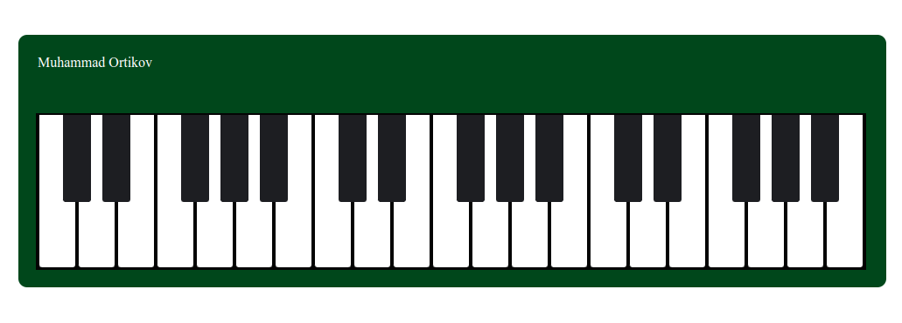
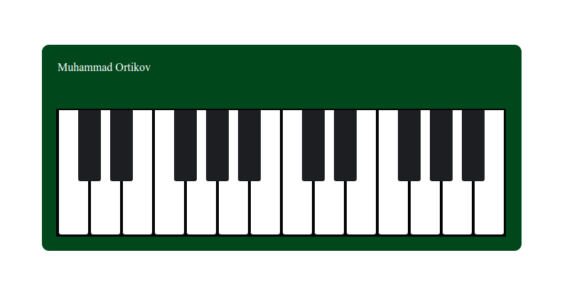

## 10-animatedWheel. Responsive design with css variables

### HTML5, CSS3, variables

(./11-info/10-wheel.mp4)
